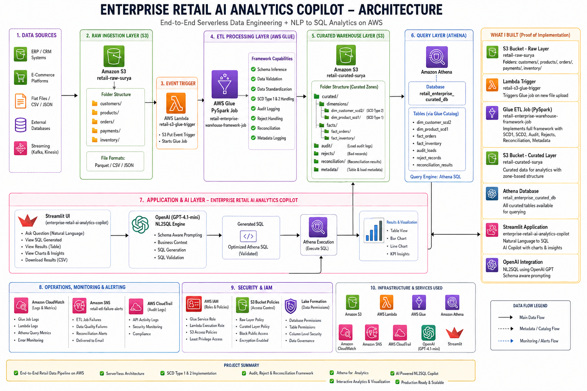
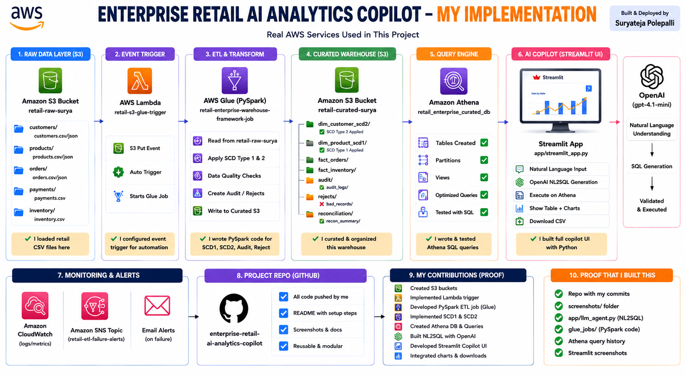
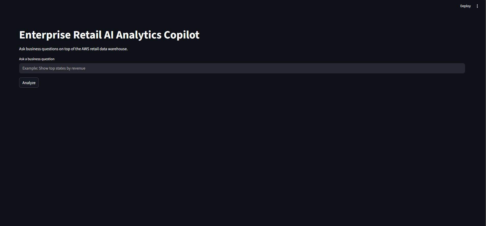
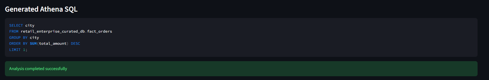
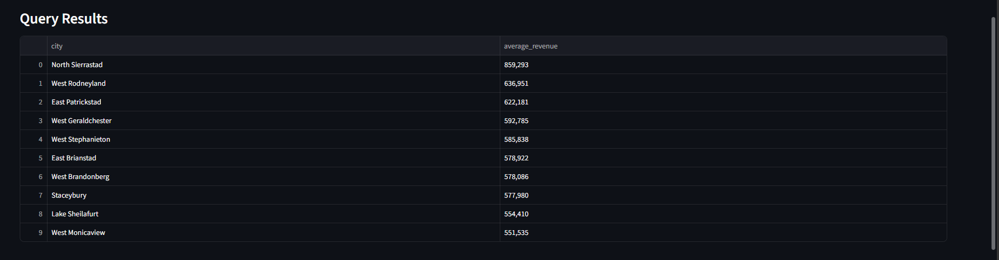
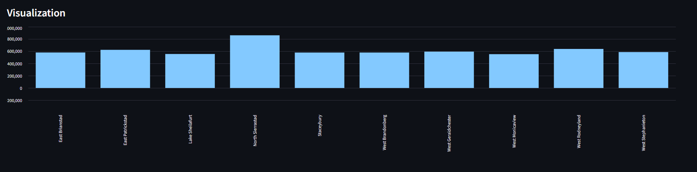

# Enterprise Retail AI Analytics Copilot

## Overview

Enterprise Retail AI Analytics Copilot is an end-to-end AWS-based analytics platform that combines:

- AWS Glue ETL pipelines
- Amazon Athena analytics
- S3 Data Lake architecture
- OpenAI-powered NL2SQL generation
- Streamlit interactive dashboard
- Enterprise data warehousing concepts

The platform allows users to ask natural language business questions such as:

- "Show top 5 states by revenue"
- "Which product has highest sales"
- "Show payment status distribution"
- "Which city has highest revenue"

The system automatically:

1. Converts natural language into Athena SQL
2. Executes queries on AWS Athena
3. Returns analytics results
4. Generates visualizations
5. Displays business insights

---

# Architecture

```text
User Question
      ↓
Streamlit Frontend
      ↓
OpenAI LLM (NL2SQL)
      ↓
Athena SQL Generation
      ↓
Amazon Athena
      ↓
Curated S3 Data Warehouse
      ↓
Query Results
      ↓
Charts & Business Insights
```

---

# AWS Services Used

| Service | Purpose |
|---|---|
| Amazon S3 | Data Lake Storage |
| AWS Glue | ETL Processing |
| AWS Lambda | Event-driven orchestration |
| Amazon Athena | SQL Analytics |
| Amazon SNS | Alerting |
| Amazon CloudWatch | Monitoring |
| Streamlit | Frontend Dashboard |
| OpenAI API | Natural Language to SQL |

---

# Enterprise Data Warehouse Components

## Fact Tables

### fact_orders

Grain:

```text
1 row = 1 order
```

### fact_inventory

Grain:

```text
1 row = 1 product in 1 warehouse
```

---

## Dimension Tables

### dim_customer_scd2

Implemented using:

- SCD Type 2
- Effective start/end dates
- Current flag tracking
- Historical customer tracking

### dim_product_scd1

Implemented using:

- SCD Type 1 overwrite logic

---

# ETL Pipeline Flow

```text
S3 Raw Layer
      ↓
AWS Lambda Trigger
      ↓
AWS Glue ETL Job
      ↓
Data Validation
      ↓
Reject Handling
      ↓
SCD Processing
      ↓
Fact & Dimension Loading
      ↓
Audit & Reconciliation
      ↓
Curated Parquet Layer
      ↓
Athena Analytics
      ↓
Streamlit AI Copilot
```

---

# Key Features

## Data Validation Framework

Implemented validations for:

- Null checks
- Duplicate handling
- Datatype casting
- Invalid record filtering
- Business rule validation

---

## Reject Handling Framework

Invalid records are redirected into dedicated reject zones with:

- Reject reason
- Rejected timestamp
- Source identification

---

## Audit Logging Framework

Audit logs capture:

- Job name
- Entity name
- Record counts
- Load timestamps
- Job status
- Target locations

---

## Reconciliation Framework

Implemented reconciliation validation between:

- Source counts
- Valid counts
- Reject counts
- Curated target counts

Ensures enterprise-grade data consistency validation.

---

# Event-Driven Architecture

Implemented serverless orchestration using:

```text
S3 Upload
   ↓
Lambda Trigger
   ↓
Glue Job Execution
```

This enables automatic ETL execution whenever new CSV files are uploaded.

---

# Monitoring & Alerting

Implemented enterprise-grade monitoring using:

- Amazon CloudWatch
- Amazon SNS Email Alerts
- Glue Job Failure Notifications

---

# AI Analytics Copilot Features

## Natural Language to SQL

Examples:

| User Question | Generated Analytics |
|---|---|
| Show top 5 states by revenue | Revenue analytics |
| Best selling product | Product ranking |
| Which city has highest revenue | Revenue analysis |
| Show payment status distribution | Payment insights |

---

## Intelligent SQL Generation

The LLM automatically:

- Generates Athena-compatible SQL
- Applies dynamic LIMIT handling
- Selects only requested columns
- Uses aggregation intelligently
- Understands ranking queries
- Supports business analytics questions

---

## Visualization Layer

Automatically generates:

- Interactive charts
- Revenue visualizations
- Ranking analytics
- KPI insights

---

# Sample Athena Queries

## Revenue by State

```sql
SELECT
    state,
    SUM(total_amount) AS revenue
FROM fact_orders
GROUP BY state
ORDER BY revenue DESC
LIMIT 5;
```

## Best Selling Product

```sql
SELECT product_name
FROM fact_orders
GROUP BY product_name
ORDER BY SUM(quantity) DESC
LIMIT 1;
```

## Low Inventory Detection

```sql
SELECT
    product_name,
    warehouse_id,
    stock_quantity
FROM fact_inventory
WHERE stock_quantity < reorder_level;
```

---

# Project Structure

```text
enterprise-retail-ai-analytics-copilot/
│
├── app/
│   ├── streamlit_app.py
│   ├── athena_client.py
│   ├── llm_agent.py
│   └── prompts.py
│
├── architecture/
├── screenshots/
├── README.md
├── requirements.txt
└── .gitignore
```

---

# Screenshots

## Architecture Diagram



---

## My Implementation Proof



## Streamlit Dashboard



## Generated Athena SQL



## Query Results



## Visualization



---

# Technical Skills Demonstrated

- AWS Glue PySpark
- Amazon Athena
- AWS Lambda
- Amazon S3
- Streamlit
- OpenAI API
- NL2SQL Architecture
- Enterprise Data Warehousing
- SCD Type 1 & Type 2
- Audit & Reconciliation Frameworks
- Data Validation
- Cloud Monitoring & Alerting
- Serverless Data Engineering
- AI Analytics Platforms

---

# Future Enhancements

- LangChain Integration
- RAG-based Metadata Search
- Vector Database Integration
- Query History
- Conversational Memory
- KPI Cards
- CSV/PDF Export
- Role-Based Access Control
- Bedrock Integration
- Terraform Infrastructure as Code
- CI/CD using GitHub Actions

---

# Author

Surya Teja Polepalli

GitHub:

https://github.com/Suryatejapolepalli