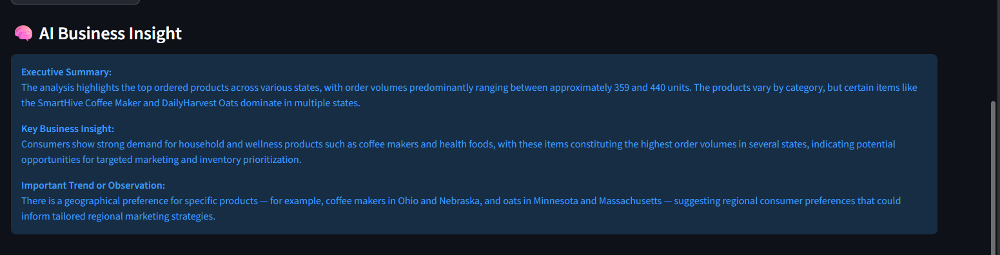

# 🚀 Enterprise Retail AI Analytics Copilot  
### AI-Powered Serverless Retail Analytics Platform on AWS


---

# 📌 Project Overview

Enterprise Retail AI Analytics Copilot is an AI-powered conversational analytics platform built on AWS using Amazon Athena, AWS Glue, Amazon S3, OpenAI, and Streamlit.

The application enables business users to ask natural language questions and automatically receive:

- Athena SQL queries
- Analytics results
- Interactive visualizations
- AI-generated business insights
- Metadata explanations
- Query history
- CSV downloads

This project combines enterprise data engineering, cloud analytics, and generative AI to build a lightweight analytics copilot architecture.

---

# 🎯 Business Problem

Business teams often depend on data analysts and engineers to write SQL queries for reporting and analytics.

This creates:
- delays in decision-making
- dependency on technical teams
- limited self-service analytics

This application solves the problem by allowing users to ask business questions directly in natural language.

Example questions:

```text
Show top 5 states by revenue

Top 3 products by sales

Which city has highest revenue

Show payment status distribution

What does reorder_level mean?

Explain fact_orders table
```

---

# ✨ Live Features

- ✅ AI-powered Natural Language to SQL
- ✅ Amazon Athena analytics
- ✅ Interactive Streamlit dashboard
- ✅ AI-generated business insights
- ✅ Conversational analytics memory
- ✅ Metadata-aware AI assistant
- ✅ Intelligent question routing
- ✅ Query history tracking
- ✅ CSV download support
- ✅ KPI cards
- ✅ Automated visualizations
- ✅ Enterprise warehouse architecture
- ✅ SCD Type 1 and Type 2 implementation

---

# 🧠 Intelligent AI Routing

The application intelligently classifies user questions into:

## Metadata Questions

Examples:

```text
What does reorder_level mean?

Explain fact_orders table

Define revenue
```

These are answered directly using metadata-aware AI without running Athena queries.

---

## Analytics Questions

Examples:

```text
Show top 5 states by revenue

Top 3 products by sales

What is the total sum of revenue across all states?
```

These trigger:
- SQL generation
- Athena execution
- visualization
- AI business insights

---

# 🧠 AI Workflow

```text
Business Question
        ↓
Question Classification
        ↓
Metadata Route OR Analytics Route
        ↓
OpenAI GPT Processing
        ↓
Athena SQL Generation
        ↓
Amazon Athena Query Execution
        ↓
Curated S3 Data Warehouse
        ↓
Results + Charts + AI Insights
```

---

# 🏗️ Architecture Diagram

<p align="center">
  
</p>

---

# 🧾 Implementation Proof

<p align="center">
  
</p>

---

# ☁️ AWS Services Used

| Service | Purpose |
|---|---|
| Amazon S3 | Data lake storage |
| AWS Glue | PySpark ETL processing |
| AWS Lambda | Event-driven orchestration |
| Amazon Athena | Serverless SQL analytics |
| AWS Glue Data Catalog | Metadata management |
| Amazon CloudWatch | Monitoring and logging |
| Amazon SNS | Alerts and notifications |
| AWS IAM | Security and permissions |
| OpenAI API | AI-powered NL2SQL and insights |
| Streamlit | Interactive dashboard |

---

# 🧱 System Components

| Layer | Technology |
|---|---|
| Frontend | Streamlit |
| AI Layer | OpenAI GPT |
| Routing Layer | Metadata + Analytics Classifier |
| Metadata Assistant | OpenAI + Metadata Context |
| Query Engine | Amazon Athena |
| ETL Layer | AWS Glue PySpark |
| Storage Layer | Amazon S3 |
| Metadata Layer | AWS Glue Data Catalog |
| Monitoring | CloudWatch + SNS |

---

# 🔄 Enterprise ETL Pipeline Flow

```text
Retail CSV Files
        ↓
Amazon S3 Raw Layer
        ↓
AWS Lambda Trigger
        ↓
AWS Glue PySpark ETL Job
        ↓
Data Validation
        ↓
Reject Handling
        ↓
SCD Processing
        ↓
Fact and Dimension Loading
        ↓
Audit and Reconciliation
        ↓
Curated Parquet Warehouse
        ↓
Amazon Athena
        ↓
AI Analytics Copilot
```

---

# 🧱 Data Warehouse Design

## Fact Tables

### fact_orders

```text
Grain = 1 row per order
```

Used for:
- Revenue analytics
- Product sales analysis
- Customer analytics
- State and city reporting
- Payment analysis

---

### fact_inventory

```text
Grain = 1 row per product per warehouse
```

Used for:
- Inventory monitoring
- Stock analysis
- Reorder-level tracking
- Warehouse analytics

---

## Dimension Tables

### dim_customer_scd2

Implemented using SCD Type 2.

Tracks:
- customer history
- city changes
- state changes
- historical records

---

### dim_product_scd1

Implemented using SCD Type 1 overwrite logic.

Tracks:
- latest product information
- category updates
- pricing changes

---

# 🏢 Enterprise ETL Features

## Data Validation Framework

Implemented validations for:
- Null checks
- Duplicate detection
- Datatype validation
- Business rule validation

---

## Reject Handling Framework

Invalid records are redirected into reject zones with:
- reject reason
- rejected timestamp
- source information

---

## Audit Logging Framework

Audit logs capture:
- job name
- entity name
- record counts
- load timestamps
- target locations
- job status

---

## Reconciliation Framework

Compares:
- source counts
- valid counts
- reject counts
- target counts

Ensures enterprise-grade data consistency.

---

## Monitoring and Alerting

Implemented using:
- Amazon CloudWatch
- SNS email alerts
- Glue failure notifications

---

# 📊 AI Analytics Features

## Natural Language to SQL

Example:

```text
Show top 5 states by revenue
```

Generated Athena SQL:

```sql
SELECT
    state,
    SUM(total_amount) AS revenue
FROM retail_enterprise_curated_db.fact_orders
GROUP BY state
ORDER BY revenue DESC
LIMIT 5;
```

---

## AI Business Insights

After Athena query execution, OpenAI generates executive-level business insights.

Example:

```text
California generated the highest revenue among all states.
Revenue concentration indicates strong regional demand.
Electronics products dominate overall sales performance.
```

---

## Conversational Analytics Memory

The application remembers previous analytics context during the session.

Example:

```text
User: Show top 5 states by revenue

User: Now show only top 3
```

The AI understands the previous analytics context.

---

## Metadata-Aware Assistant

The assistant can answer metadata and business glossary questions without executing Athena queries.

Example:

```text
What does reorder_level mean?

Explain fact_orders table
```

---

## Query History

Stores recent user questions and analytics activity during the session.

---

## CSV Export

Users can download Athena query results directly from the dashboard.

---

## Automated Visualizations

Automatically generates charts for numeric analytics results.

Examples:
- Revenue by state
- Sales by product
- Inventory analysis
- Payment status distribution

---

# 📸 Application Screenshots

## Dashboard

<p align="center">
  
</p>

---

## Generated Athena SQL

<p align="center">
  
</p>

---

## Query Results

<p align="center">
  
</p>

---

## Visualization

<p align="center">
  
</p>

---

## AI Business Insights

<p align="center">
  
</p>

---

## AI Query History

<p align="center">
  
</p>

---

## Metadata Assistant

<p align="center">
  
</p>

---

# 🧪 Sample Athena Queries

## Revenue by State

```sql
SELECT
    state,
    SUM(total_amount) AS revenue
FROM retail_enterprise_curated_db.fact_orders
GROUP BY state
ORDER BY revenue DESC
LIMIT 5;
```

---

## Best Selling Product

```sql
SELECT
    product_name
FROM retail_enterprise_curated_db.fact_orders
GROUP BY product_name
ORDER BY SUM(quantity) DESC
LIMIT 1;
```

---

## Payment Status Distribution

```sql
SELECT
    payment_status,
    COUNT(*) AS total_count
FROM retail_enterprise_curated_db.fact_orders
GROUP BY payment_status
LIMIT 10;
```

---

## Low Inventory Detection

```sql
SELECT
    product_name,
    warehouse_id,
    stock_quantity,
    reorder_level
FROM retail_enterprise_curated_db.fact_inventory
WHERE stock_quantity < reorder_level;
```

---

# ▶️ Run Locally

```bash
git clone https://github.com/Suryatejapolepalli/enterprise-retail-ai-analytics-copilot.git

cd enterprise-retail-ai-analytics-copilot

python -m venv venv

venv\Scripts\activate

pip install -r requirements.txt

streamlit run app/streamlit_app.py
```

---

# 🔐 Security

- OpenAI API keys are managed using environment variables
- AWS credentials are configured using AWS CLI profiles
- No secrets or credentials are hardcoded
- `.gitignore` prevents local files from being pushed
- API keys should never be committed to GitHub

Example:

```bash
setx OPENAI_API_KEY "your_api_key_here"
```

---

# 📂 Project Structure

```text
enterprise-retail-ai-analytics-copilot/
│
├── app/
│   ├── streamlit_app.py
│   ├── athena_client.py
│   ├── llm_agent.py
│   ├── prompts.py
│   ├── insight_generator.py
│   ├── metadata_context.py
│   ├── metadata_assistant.py
│   └── question_classifier.py
│
├── architecture/
│   ├── architecture_diagram.png
│   └── implementation_proof.png
│
├── screenshots/
│   ├── dashboard.png
│   ├── generated_sql.png
│   ├── query_results.png
│   ├── chart.png
│   ├── ai_business_insights.png
│   ├── query_history.png
│   └── metadata_assistant.png
│
├── README.md
├── requirements.txt
└── .gitignore
```

---

# 🛠️ Technical Skills Demonstrated

## AWS and Cloud

- Amazon S3
- AWS Glue
- AWS Lambda
- Amazon Athena
- AWS Glue Data Catalog
- Amazon CloudWatch
- Amazon SNS
- AWS IAM

---

## Data Engineering

- PySpark ETL
- Data Warehousing
- Dimensional Modeling
- SCD Type 1
- SCD Type 2
- Data Validation
- Audit Logging
- Reconciliation
- Reject Handling

---

## AI and Analytics

- OpenAI API
- Prompt Engineering
- NL2SQL
- Conversational Analytics
- Metadata Grounding
- AI Business Insights
- Streamlit Dashboarding
- Intelligent Query Routing

---

# 📈 Project Impact

This project demonstrates how enterprise data engineering and generative AI can be combined to build intelligent analytics copilots.

The solution reduces dependency on manual SQL writing and enables business users to interact with enterprise data warehouses using natural language.

The project also demonstrates modern conversational analytics architecture patterns used in enterprise AI platforms.

---

# 💼 Resume Highlights

- Built an AI-powered conversational analytics copilot using AWS Athena, OpenAI, Streamlit, and enterprise data warehousing concepts.
- Developed intelligent metadata-aware routing between analytics queries and metadata questions.
- Implemented AI-generated executive insights, conversational memory, query history, CSV export, KPI cards, and automated visualizations.
- Built serverless ETL pipelines using AWS Glue, Lambda, S3, Athena, CloudWatch, and SNS.
- Implemented SCD Type 1 and Type 2 dimensional modeling using PySpark.

---

# ⚠️ Limitations

- Current version uses lightweight keyword-based routing
- Query history is session-based only
- Complex SQL edge cases may require validation improvements
- Authentication and RBAC are not yet implemented
- Current implementation uses OpenAI SDK directly instead of LangChain or LangGraph

---

# 🚀 Future Enhancements

- LangChain or LangGraph agent workflows
- RAG-based vector search
- SQL validation and auto-retry layer
- Persistent query history using DynamoDB or PostgreSQL
- Redis caching
- Role-based access control
- Docker deployment
- Terraform IaC
- CI/CD pipelines
- AWS Bedrock integration
- Live cloud deployment

---

# 👨‍💻 Author

### Surya Teja Polepalli

GitHub:  
https://github.com/Suryatejapolepalli

Project Repository:  
https://github.com/Suryatejapolepalli/enterprise-retail-ai-analytics-copilot

---

# ⭐ Project Highlights

✅ AI-Powered Conversational Analytics  
✅ AWS Serverless Data Engineering  
✅ OpenAI NL2SQL Integration  
✅ Metadata-Aware AI Assistant  
✅ Enterprise Warehouse Architecture  
✅ Conversational Memory  
✅ AI Business Insights  
✅ Automated Visualizations  
✅ Streamlit Interactive Dashboard  
✅ Resume and Interview Ready Project