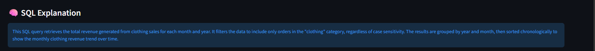
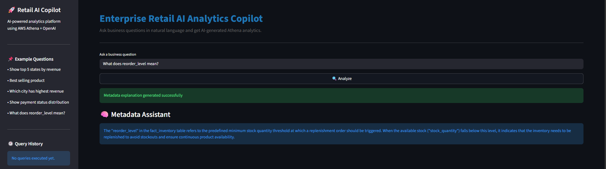
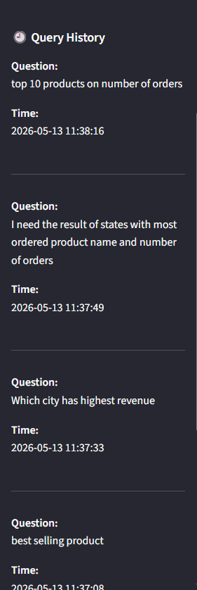

# 🚀 Enterprise Retail AI Analytics Copilot

AI-powered enterprise analytics platform built using AWS Athena, OpenAI, Streamlit, AWS Glue, and Amazon S3.

This project enables business users to ask natural language questions and receive:
- AI-generated Athena SQL
- Interactive visualizations
- AI business insights
- SQL explanations
- Metadata-aware responses
- Downloadable analytics results

---

# ✨ Features

## ✅ Natural Language to SQL (NL2SQL)

Convert business questions into optimized Athena SQL queries using OpenAI.

### Example

```text
Show top 5 states by revenue
```

---

## ✅ AI Business Insights

Automatically generates:
- Executive summaries
- Key business insights
- Trend observations

using OpenAI after Athena query execution.

---

## ✅ Metadata Assistant

Handles metadata/business glossary questions without querying Athena.

### Examples

```text
What does reorder_level mean?

Explain fact_orders table
```

---

## ✅ Intelligent Query Routing

Application automatically classifies:
- Metadata questions
- Analytics questions

to optimize query execution and response time.

---

## ✅ Interactive AI Visualizations

Dynamic chart generation using Plotly:
- 📊 Bar Charts
- 📈 Line Charts
- 🥧 Pie Charts

### Interactive Features
- Zoom In / Zoom Out
- Hover Analytics
- Fullscreen Mode
- Export as PNG

---

## ✅ SQL Explanation Layer

Explains generated SQL queries in simple business language.

### Example

```text
This query calculates total revenue grouped by state.
```

---

## ✅ Query History

Stores:
- Question history
- SQL history
- Execution timestamps

inside Streamlit session state.

---

## ✅ Athena Query Optimization

Implemented:
- SQL validation
- Athena-compatible syntax checks
- Query caching
- Case-insensitive filtering logic

---

# 🏗️ Enterprise Architecture

<p align="center">
  
</p>

---

# 🛠️ My Implementation

<p align="center">
  
</p>

---

# 📸 Application Screenshots

## AI Visualization

<p align="center">
  
</p>

---

## SQL Explanation Layer

<p align="center">
  
</p>

---

## Metadata Assistant

<p align="center">
  
</p>

---

## Query History

<p align="center">
  
</p>

---

# ⚙️ AWS Services Used

- Amazon S3
- AWS Glue
- AWS Lambda
- Amazon Athena
- AWS CloudWatch
- AWS SNS

---

# 🤖 AI & Analytics Stack

- OpenAI GPT-4.1-mini
- Streamlit
- Plotly
- Pandas
- PyAthena

---

# 📂 Project Structure

```text
enterprise-retail-ai-analytics-copilot/
│
├── app/
│   ├── streamlit_app.py
│   ├── llm_agent.py
│   ├── insight_generator.py
│   ├── metadata_assistant.py
│   ├── metadata_context.py
│   ├── sql_explainer.py
│   ├── question_classifier.py
│   ├── athena_client.py
│   └── prompts.py
│
├── screenshots/
│
├── glue_jobs/
│
├── requirements.txt
│
└── README.md
```

---

# 🚀 How to Run

## 1️⃣ Clone Repository

```bash
git clone https://github.com/Suryatejapolepalli/enterprise-retail-ai-analytics-copilot.git
```

---

## 2️⃣ Install Dependencies

```bash
pip install -r requirements.txt
```

---

## 3️⃣ Configure Environment Variables

Set:

```text
OPENAI_API_KEY
AWS_ACCESS_KEY_ID
AWS_SECRET_ACCESS_KEY
AWS_REGION
```

---

## 4️⃣ Start Streamlit Application

```bash
streamlit run app/streamlit_app.py
```

---

# 🧠 Example Business Questions

```text
Show top 5 states by revenue

Show payment status distribution

Show monthly revenue trend

Show top products by sales

What does reorder_level mean?

Explain fact_orders table
```

---

# 🔥 Enterprise-Level Capabilities

✅ AI-Powered NL2SQL  
✅ Interactive Analytics  
✅ Metadata Intelligence  
✅ Conversational Analytics  
✅ Query Optimization  
✅ SQL Explainability  
✅ Athena Serverless Analytics  
✅ Enterprise Data Warehouse Architecture  
✅ Plotly Interactive Visualization  
✅ AWS Cloud-Native Data Engineering  

---

# 👨‍💻 Built By

## Surya Teja Polepalli

Enterprise Data Engineering | AI Analytics | AWS | GenAI Applications