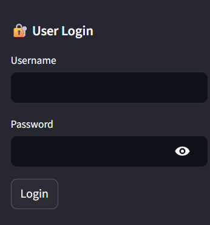
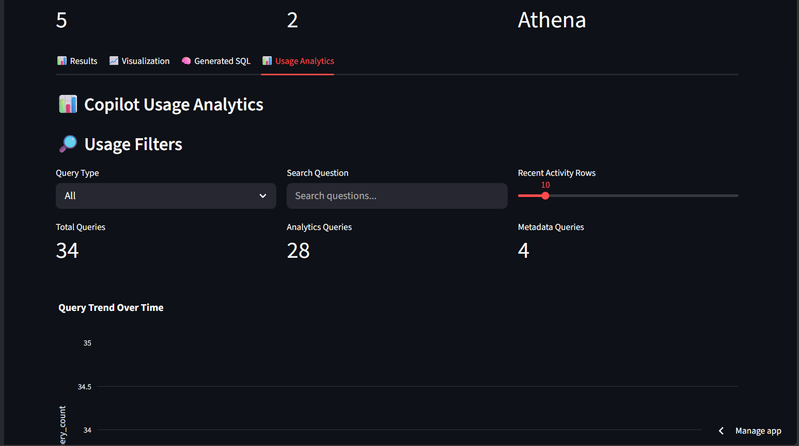

# 🚀 Enterprise Retail AI Analytics Copilot

AI-powered enterprise analytics platform built using **AWS Athena, AWS Glue, Amazon S3, OpenAI, Streamlit, Plotly, DynamoDB, Role-Based Access Control (RBAC), and RAG-based metadata search**.

This project enables business users to ask natural language questions and receive:

- AI-generated Athena SQL
- Interactive Plotly visualizations
- AI business insights
- SQL explanations
- RAG-based metadata responses
- Query history tracking
- Usage analytics dashboard
- Role-based login
- Downloadable analytics results

---

## 🌐 Live Demo

https://enterprise-retail-ai-analytics-copilot-amecggjsprkhai987fhfej.streamlit.app/

---

## ✨ Features

### ✅ Natural Language to SQL

Converts business questions into Athena SQL using OpenAI.

```text
Show top 5 states by revenue
```

---

### ✅ RAG-Based Metadata Assistant

Answers metadata and glossary questions without running Athena.

```text
What is dim_customer_scd2?

What does reorder_level mean?

Explain fact_orders table
```

---

### ✅ Intelligent Query Routing

Routes questions into:

```text
Metadata Question → RAG Metadata Assistant

Analytics Question → OpenAI SQL → Athena → Charts + Insights
```

---

### ✅ AI Business Insights

Generates executive-style business summaries after Athena query execution.

---

### ✅ SQL Explanation Layer

Explains generated SQL in simple business language.

---

### ✅ Interactive Plotly Visualizations

Supports:

- Bar charts
- Line charts
- Pie charts
- Trend analysis
- Ranking charts
- Hover analytics
- Export image

---

### ✅ Query History + DynamoDB Logging

Stores:

- User questions
- Generated SQL
- Query type
- AI insights
- Timestamps

Supports:

- Analytics history
- Metadata history
- Audit tracking

---

### ✅ Usage Analytics Dashboard

Built an admin analytics dashboard with:

- Total query count
- Analytics vs Metadata usage
- Query trend analysis
- Search filters
- Top questions
- Recent activity

---

### ✅ User Authentication + RBAC

Supports role-based access control.

Roles:

### Admin

Access:

- Query execution
- Metadata assistant
- Usage analytics dashboard
- Monitoring access

### Analyst

Access:

- Query execution
- Metadata assistant

Restricted:

- Usage analytics dashboard

---

## 🧠 AI Workflow

```text
User Question
      ↓
Question Classifier
      ↓
Metadata Route OR Analytics Route
      ↓
RAG Metadata Search OR OpenAI NL2SQL
      ↓
Athena Query Execution
      ↓
Results + Plotly Charts + AI Insights
      ↓
DynamoDB Logging
```

---

## 📸 Application Screenshots

### User Login + RBAC

<p align="center">
  
</p>

---

### Usage Analytics Dashboard

<p align="center">
  
</p>

---

### Metadata Assistant

<p align="center">
  
</p>

---

### Query History Tracking

<p align="center">
  
</p>

---

## 🤖 AI and Analytics Stack

| Component | Tool |
|---|---|
| NL2SQL | OpenAI |
| Metadata RAG | OpenAI + RAG |
| Dashboard | Streamlit |
| Charts | Plotly |
| Query Engine | Amazon Athena |
| Query Logging | DynamoDB |
| Authentication | RBAC |
| Data Processing | AWS Glue PySpark |
| Storage | Amazon S3 |

---

## 📂 Project Structure

```text
enterprise-retail-ai-analytics-copilot/
│
├── app/
│   ├── streamlit_app.py
│   ├── athena_client.py
│   ├── llm_agent.py
│   ├── insight_generator.py
│   ├── sql_explainer.py
│   ├── metadata_assistant.py
│   ├── metadata_documents.py
│   ├── rag_metadata.py
│   ├── question_classifier.py
│   ├── business_glossary.py
│   └── query_logger.py
│
├── architecture/
├── screenshots/
├── requirements.txt
├── README.md
└── .gitignore
```

---

## ⚠️ Limitations

- User authentication uses Streamlit secrets
- Query history currently stored in DynamoDB
- Complex SQL edge cases may require stronger validation
- Role management is lightweight

---

## 🚀 Future Enhancements

- LangGraph multi-agent workflow
- AWS Bedrock integration
- User-specific query history
- Cost monitoring dashboard
- CI/CD with GitHub Actions
- Terraform deployment
- Real-time streaming analytics

---

## ⭐ Project Highlights

✅ Deployed GenAI analytics application  
✅ AWS serverless data engineering  
✅ OpenAI-powered NL2SQL  
✅ RAG-based metadata assistant  
✅ DynamoDB query tracking  
✅ Role-based access control  
✅ Usage analytics dashboard  
✅ Plotly interactive dashboards  
✅ AI-generated business insights  
✅ Enterprise AI architecture